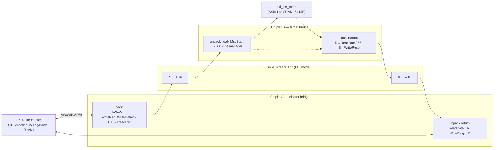
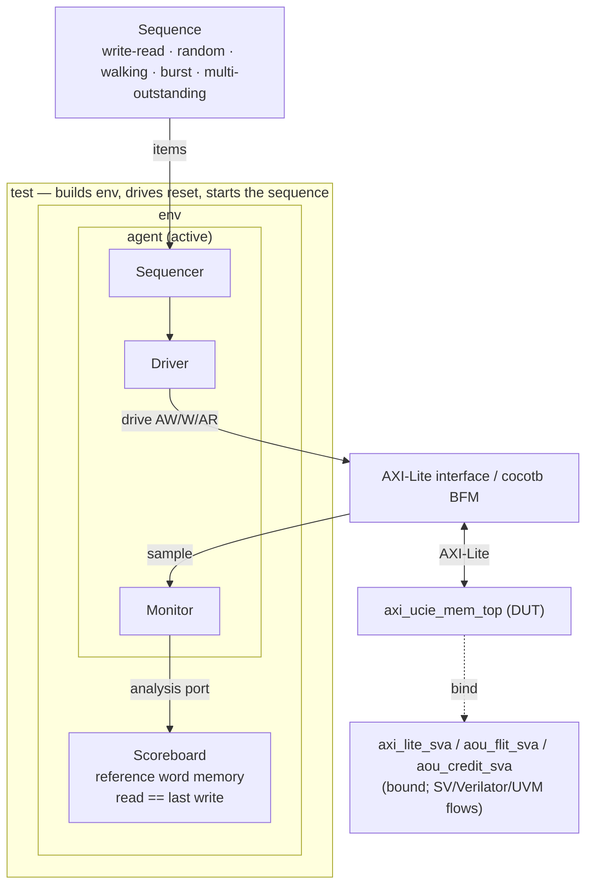

# axi-on-ucie-to-mem

[](https://github.com/markrthomas/axi-on-ucie-to-mem/actions/workflows/ci.yml)

**AXI4-Lite transported over an AXI-over-UCIe (AoU) link to an AXI-Lite memory**,
verified in **five DV environments** — cocotb + PyUVM, Icarus, Verilator, SystemC,
and a license-gated SystemVerilog UVM mirror — that all cross-check the same
design against the same reference-memory model. Digital-only, open-source
toolchain. Sibling project to `uvm_review`.

## What it is

The design bridges an on-chip **AXI4-Lite** interface across a modeled **UCIe
streaming (FDI) link** using the **AXI-over-UCIe (AoU) Basic Profile** message
set, delivering transactions to a far-side **AXI4-Lite SRAM memory**. AXI is the
OCA non-coherent bus protocol carried over UCIe (OCA System Architecture spec
§5.2), so the memory speaks AXI natively rather than a peripheral bus like APB.

Two "chiplets" are joined by the link. The initiator bridge turns AXI writes and
reads into AoU messages, **packs multiple messages into one 250-byte PLP flit**
(a real 10-byte protocol header with the `MsgStart[47:0]` granule bitmap plus
48 × 5-byte granules of payload), and the target bridge **walks that bitmap** to
unpack them and drive the memory.



## AoU Basic-Profile mapping (spec §5)

Each AXI transaction maps to AoU messages with the spec's exact field widths and
granule counts (1 granule = 5 bytes = 40 bits; 48 granules per PLP payload):

| AXI action | AoU messages (granules) | Direction |
|------------|-------------------------|-----------|
| write (AW+W) | `WriteReq` (3) + `WriteData256` (8) packed in one flit | A → B |
| read (AR)    | `ReadReq` (3)                                          | A → B |
| read data (R)  | `ReadData256` (8)                                   | B → A |
| write resp (B) | `WriteResp` (1)                                     | B → A |

A write flit therefore carries **two messages** (`MsgStart` bits 0 and 3 set),
exercising real multi-message packing; the unpacker is bitmap-driven. This build
covers the Basic Profile, 32-bit AXI4 with **INCR/WRAP/FIXED
bursts** (`AxLEN` beats, `AxSIZE`, burst type carried in `FLEX[1:0]` since AoU has
no `AxBURST`; the target expands each burst into single-beat AXI-Lite accesses,
`DLENGTH=256b` per beat) and **multiple-outstanding transactions with in-order
completion** (a request queue in the initiator bridge lets several transactions be
in flight at once). AXI data occupies the low 32 bits of the AoU data field and
the AoU 10-bit ID carries a per-transaction tag echoed on `{B,R}ID`. Flit fields are packed **byte-exact** to the spec (§5.8 message
layouts and the §4.3 Figure-5 protocol header), and **§6 per-message-type credit
flow control** runs on both bridges, carried in the header `MsgCredit`
field.  Resource plane **RP0 is the shipping default**, and **multiple resource
planes (RP0..RP3) are an opt-in mode** — `NUM_RP` (see below) gives each plane its
own credit banks, activation FSM and outstanding tracking over one shared link,
arbitrated round-robin and routed by the §4.3 `FDId`. The interface follows the full §8 activation state machine — bring-up
(with a §6.4.2 `CrdtGrant` / §6.4.3 reset credit exchange), teardown,
re-activation, and `ERROR` recovery (no AXI accepted until `ENABLED`).
See [`docs/PLAN.md`](docs/PLAN.md) for the full architecture and the remaining
follow-ons.

## Directory layout

- `rtl/` — the design:
  - `aou_pkg.sv` — AoU message formats + flit pack/unpack helper functions
  - `ucie_stream_link.sv` — one-directional flit channel (FDI-boundary model)
  - `aou_axi_initiator_bridge.sv` / `aou_axi_target_bridge.sv` — the two bridges
  - `aou_reorder.sv` — per-ID response reorder buffer (wired in at `OOO_EN=1`)
  - `aou_ooo_resp_src.sv` — opt-in out-of-order response source at the target (`OOO_EN=1`)
  - `aou_rp_mux.sv` — resource-plane arbiter / `FDId` router + per-plane receive queue (`NUM_RP>1`)
  - `axi_lite_mem.sv` — AXI4-Lite SRAM memory target
  - `axi_ucie_mem_top.sv` — the DUT top (wires the chain + return link)
- `dv/cocotb/` — cocotb + PyUVM testbench (the golden runnable env)
- `dv/sv/` — portable self-checking SV directed TB (Icarus + Verilator)
- `dv/sva/` — AXI-Lite + AoU-flit + §6 credit assertion checkers (bound to the DUT)
- `dv/pack/` — §4.3/§5.8 byte-exact packing conformance TB (Icarus + Verilator)
- `dv/act/` — §8 activation FSM unit test: deactivate / re-activate / `ERROR` (Icarus + Verilator)
- `dv/reorder/` — per-ID response reorder buffer unit test: out-of-order-by-ID completion (Icarus + Verilator)
- `dv/ooo/` — **end-to-end out-of-order-by-ID chain** (`OOO_EN=1`): interleaved multi-ID traffic, real different-ID overtake (Icarus + Verilator)
- `dv/mrp/` — **end-to-end multiple resource planes** (`NUM_RP=2`): interleaved two-plane traffic, per-plane credit banks / routing, arbiter fairness (Icarus + Verilator)
- `dv/systemc/` — SystemC testbench (`verilator --sc` model + `sc_main`)
- `uvm/` — SystemVerilog UVM TB (multi-file + single-file), license-gated
- `sim/` — Verilator C++ coverage harness
- `formal/` — SymbiYosys proofs (`.sby` + property wrappers): `axi_lite_mem`, the
  §4.3 flit protocol header, §6 credit flow control on the real bridges, and the
  §8 interface activation FSM
- `Dockerfile` / `docker/` / `railway.toml` — containerized DV gate (see [`docs/DOCKER.md`](docs/DOCKER.md))
- `metrics/` — per-run metrics DB + self-contained HTML dashboard (opt-in, **off
  the gate path**): `schema.sql`, `collect.py`, `dashboard.py`,
  `coefficients.json`, `capture.sh`, and the committed `metrics.db` /
  `dashboard.html` — see [Metrics & dashboard](#9-metrics--dashboard)
- `Makefile` — standard DV gate targets; `docs/PLAN.md` — the design plan

## The five DV environments

All drive the same DUT and check reads against a reference word memory.

| Environment | Directory | Runs here? | What it is |
|-------------|-----------|-----------|------------|
| cocotb + PyUVM | `dv/cocotb/` | ✅ | AXI-Lite BFM + driver/monitor/agent/scoreboard; write-read / random / walking / burst / multi-outstanding tests |
| Icarus (SV) | `dv/sv/` | ✅ | portable self-checking SV directed TB under `iverilog`+`vvp` |
| Verilator (SV) | `dv/sv/` | ✅ | same SV TB under `--binary --timing`, **plus bound SVA** (`--assert`) |
| SystemC | `dv/systemc/` | ✅ | `verilator --sc` DUT model + hand-written `sc_main` driver/scoreboard |
| SystemVerilog UVM | `uvm/` | ⚠️ skips | full UVM mirror; needs VCS/Xcelium/Questa — skips cleanly if unlicensed |

The **PyUVM** and **UVM** testbenches map one-for-one:

| PyUVM (`dv/cocotb/`) | SystemVerilog UVM (`uvm/`) |
|----------------------|----------------------------|
| `axi_lite_bfm.py` (cocotb BFM) | `axi_lite_if.sv` + driver/monitor virtual interface |
| `AxiSeqItem` | `axi_seq_item.sv` |
| `axi_seq.py` sequences | `axi_sequences.sv` |
| driver / monitor / agent | `axi_driver.sv` / `axi_monitor.sv` / `axi_agent.sv` |
| `AxiScoreboard` | `axi_scoreboard.sv` |
| `AxiEnv` | `axi_env.sv` |
| tests + `@cocotb.test` | `axi_test.sv` + `axi_ucie_tb_top.sv` (`run_test`) |



## Verification

Everything runs from the repo root and degrades gracefully if a tool is absent.

| Flow | Command | What it does |
|------|---------|--------------|
| Full regression | `make test` | all six cocotb tests (write-read, random, walking, burst, multi-outstanding, coverage closure); ends with the `[COV-FUNC]` functional-coverage report + floor |
| Directed | `make test-write-read` / `test-random` / `test-walking` / `test-burst` / `test-outstanding` / `test-coverage` | one cocotb test |
| SV (Icarus) | `make sv` | portable SV directed TB under Icarus |
| SV (Verilator) | `make vlt` | same TB under Verilator + bound SVA assertions |
| Packing | `make pack` | §4.3/§5.8 byte-exact packing conformance, incl. 512b/1024b data (Icarus + Verilator) |
| Activation | `make act` | §8 activation FSM unit test: bring-up / deactivate (Opt-1 & Opt-2) / ERROR (Icarus + Verilator) |
| Reorder | `make reorder` | per-ID response reorder buffer: out-of-order-by-ID completion (Icarus + Verilator) |
| OOO chain | `make ooo` | end-to-end out-of-order-by-ID datapath (`OOO_EN=1`): real different-ID overtake, same-ID order, no cross-ID leakage (Icarus + Verilator) |
| Resource planes | `make mrp` | end-to-end multi-plane datapath (`NUM_RP=2`): per-plane routing, no cross-plane credit leakage, arbiter fairness under contention (Icarus + Verilator) |
| SystemC | `make systemc` | SystemC TB (Verilator `--sc` + `sc_main`) |
| SV/UVM | `make uvm` | UVM TB (VCS/Xcelium/Questa); skips cleanly if unlicensed |
| Waves | `make waves` / `make wave` / `make wave-sv\|-ooo\|-mrp\|-act` | dump / open GTKWave with the **per-test layout** from `dv/waves/` |
| Wave layout guard | `make wave-check` | every `.gtkw` net path must still exist in its dump (dev-only; deliberately **not** in `check`/`ci`) |
| Lint | `make lint` | `iverilog -Wall` + Verilator RTL lint |
| Line coverage | `make coverage` | Verilator `--coverage` → `sim/coverage.info` (floor `COV_MIN`, default 85%; ~90–94% achieved) |
| Functional coverage | `make test` | PyUVM covergroup model (`dv/cocotb/axi_coverage.py`) sampled from the monitor → `[COV-FUNC]` report (floor `FCOV_MIN`, default 100%; 26/26 bins achieved) |
| Formal | `make formal` | SymbiYosys proofs of `axi_lite_mem`, the §4.3 flit header, §6 credit flow and the §8 activation FSM (`bmc` + `cover` gate, unbounded `prove` best-effort); `SBY=<path>` for an out-of-PATH prover, skips cleanly if `sby` absent |
| Gate | `make check` | lint + cocotb + SV(both sims) + pack + act + reorder + ooo + mrp + SystemC |
| CI | `make ci` | `check` + coverage + formal as one pass/fail gate |
| Container | `docker run --rm aou-dv` | the whole `make ci` gate in a reproducible image ([`docs/DOCKER.md`](docs/DOCKER.md)) |
| Debug logging | `make <target> VERBOSE=1\|2` | decoded AoU flit trace (L1) / + internal DUT state (L2), per-test files under `logs/` |

Run `make help` for the full list.

### Debug logging

One knob, three levels, every DV environment. `VERBOSE=<lvl>` on any target
exports `AOU_VERBOSE` to the sub-makes, which pass it on as `+verbose=<lvl>`
(SV under Icarus/Verilator) or as an environment variable (cocotb, SystemC):

| Level | Name | What it adds |
|-------|------|--------------|
| `0` | off (**default**) | nothing — every env's stdout is byte-identical to a build without the facility, so CI banners, the committed `dv/systemc/sc.log` and the coverage ratio are unaffected |
| `1` | packet | one **decoded AoU flit** line per UCIe link handshake (msgtype, FDId/plane, MsgStart, MsgCredit incl. the RP subfield, granule count and the per-type fields) in the envs that carry real flits — cocotb, `sv`, `systemc`, `ooo`, `mrp` — plus the per-check detail of the unit envs (`pack`, `act`, `reorder`) and the existing per-beat AXI transaction trace |
| `2` | full debug | level 1 plus internal DUT state: §8 activation FSMs, bridge FSMs, §6 per-message-type credit counters, initiator request-queue occupancy, reorder-buffer slot state, RP arbiter grants + per-plane RX-queue depth, and the OOO hold state |

Every level also writes a **per-test log file** under `logs/` (gitignored, swept
by `make clean`) so a failing run stays inspectable afterwards:

| Env | File(s) |
|-----|---------|
| cocotb | `logs/cocotb_<testcase>.log` |
| `sv` / `ooo` / `mrp` / `pack` / `act` / `reorder` | `logs/<env>_icarus.log`, `logs/<env>_verilator.log` |
| `systemc` | `logs/systemc.log` |

```bash
make sv VERBOSE=1          # decoded flits + AXI beats -> logs/sv_icarus.log
make test-burst VERBOSE=1  # cocotb  -> logs/cocotb_burst_test.log
make ooo VERBOSE=2         # + OOO hold state and reorder-buffer slots
make systemc VERBOSE=1     # -> logs/systemc.log (sc.log itself stays unchanged)
```

A decoded flit line looks like this (the same rendering in every environment —
one decoder per language, `dv/common/aou_flit_log.{svh,py,h}`, kept
field-for-field identical):

```
[SV-TB][F] t=115 A->B fdid=0 crd=0x0000(rp=0 wreq=0 rreq=0 wdata=0 rdata=0 wresp=0) ms=0x000000000001 g=0 WriteReq gran=3 id=0 addr=0x000000000000d490 len=0 size=2 burst=INCR flex=0x0001
[SV-TB][F] t=195 B->A fdid=0 crd=0x00c2(rp=0 wreq=4 rreq=0 wdata=8 rdata=0 wresp=0) ms=0x000000000001 g=0 WriteResp gran=1 id=0 resp=0 flex=0x0000
[SV-TB][D] t=125 init.fsm S_WDATA
[SV-TB][D] t=125 init.credits held(wreq=0 rreq=3 wdata=128) owed(rdata=0 wresp=0)
```

Line tags: `[V]` level banner, `[T]` AXI transaction, `[C]` unit-env check,
`[F]` decoded flit, `[D]` internal state.

The logging is **additive DV only** — no RTL was changed and no signal is ever
driven. The SV and cocotb environments observe the DUT through read-only
hierarchical references; the SystemC verbose build additionally compiles
`dv/systemc/aou_sc_dbg_top.sv`, a DV-only wrapper that re-exports those same
reads as ports (a Verilator `--sc` model exposes only its ports to `sc_main`).
The default `VERBOSE=0` SystemC build verilates `axi_ucie_mem_top` directly, as
before. The log files are for humans; **CI runs at `VERBOSE=0`**.

## Tutorial

Every command is run from the repo root unless noted.

### 1. Toolchain

The runnable flows need Icarus Verilog, Verilator **5.x** (for `--binary` /
`--timing` / `--sc`), a Python with cocotb + pyuvm, and (for SystemC)
`libsystemc-dev`:

```bash
iverilog -V | head -1
verilator --version                 # expect 5.x
python3 -c "import cocotb, pyuvm; print(cocotb.__version__, pyuvm.__version__)"
```

If missing: `python3 -m pip install cocotb==1.9.2 pyuvm==4.0.1`. The cocotb
runner pins `ICARUS_BIN_DIR=/usr/bin` and the cocotb-bound interpreter so the VPI
is built against the same Python that imports the testbench.

### 2. Run the regression

```bash
make test        # six cocotb PASS lines + the [COV-FUNC] report, exit 0
```

Each test builds the env, pulses reset via the BFM, runs its sequence, and the
scoreboard asserts `errors == 0` in its check phase.  Every test also feeds a
functional coverage model, and the last one (`coverage_test`) gates the merged
result — see [Functional coverage](#functional-coverage) below.

### 3. The other environments

```bash
make sv          # SV directed TB under Icarus       -> "[SV] Icarus PASSED"
make vlt         # SV directed TB under Verilator + SVA -> "[SV] Verilator PASSED"
make pack        # byte-exact packing conformance      -> "[PACK] Icarus/Verilator PASSED"
make ooo         # end-to-end OOO_EN=1 chain           -> "[OOO] Icarus/Verilator PASSED"
make mrp         # end-to-end NUM_RP=2 multi-plane chain -> "[MRP] Icarus/Verilator PASSED"
make systemc     # SystemC TB                          -> "[SC] SystemC PASSED"
```

**Out-of-order mode (`OOO_EN`, opt-in, default `0`).** `axi_ucie_mem_top` takes an
`OOO_EN` parameter. At the shipping default `0` the chain is exactly the in-order
datapath every other environment exercises — the out-of-order logic lives in
`generate` branches that are not elaborated, so it is bit- and cycle-identical.
At `OOO_EN=1` the target bridge gains `aou_ooo_resp_src`, which may let a later
**different-ID** response overtake an earlier one on the link (never same-ID,
never splitting a burst), and the initiator bridge gains two `aou_reorder`
buffers (reads → R, writes → B) that re-establish AXI ordering. `make ooo` proves
it end-to-end:

```
[OOO-TB] PASS: 80 read beats checked, 4 R + 6 B different-ID overtakes, 0 errors
```

**Multiple resource planes (`NUM_RP`, opt-in, default `1`).** `axi_ucie_mem_top`
also takes a `NUM_RP` parameter (docs/PLAN.md **F1**). At the shipping default `1`
the whole multi-plane path lives in an un-elaborated `generate` branch and the
chain is the single-plane RP0 datapath, byte-for-byte — every AXI port keeps its
historical width, every flit its historical byte map (`make pack` proves the RP0
byte map is identical to the per-plane builders at `rp=0`).

At `NUM_RP>1` the AXI front end is **replicated per plane** and the replicas are
flattened into the *same* boundary ports (plane `p` owns bit slice `[p*W +: W]`),
so no port is added and a response delivered to the wrong plane is observable at
the boundary. Each plane gets its own initiator bridge, target bridge, §8
activation FSM, §6 credit banks, outstanding tracking and memory image; the planes
share **one** pair of UCIe links through `rtl/aou_rp_mux.sv`:

- `aou_rp_arb` — round-robin egress, so every ready plane is served within
  `NUM_RP` grants; the grant is locked while the link stalls so the presented
  flit stays stable.
- `aou_rp_route` — ingress routed by the §4.3 `FDId` into that plane's **own**
  receive queue, sized to the largest §6 credit grant (16 flits). §6.1 says a
  credit guarantees the receiver has room; owning that room is what stops one
  plane back-pressuring the shared link and stalling the others.

The plane id rides end-to-end as the §4.3 `FDId`, the §5.8 `RP` field and the
Table-16 `MsgCredit` RP subfield, and `CrdtGrant`/`ActivateReq` use each plane's
own Table-18 / Table-25 slot — so a credit granted to one plane can never release
a message on another. `make mrp` proves it end-to-end:

```
[MRP-TB] PASS: 2 planes, 76 read beats checked, A->B flits rp0=70 rp1=69 (102 interleavings), 6 contended cycles won rp0=1 rp1=5, 0 errors
```

with both planes writing the **same addresses with different data** (per-plane
routing), plane 1's credit bank required not to move by a single count while only
plane 0 runs (no credit leakage), a deliberately **jammed** plane 0 that must not
stall plane 1 (no cross-plane starvation), and arbiter fairness measured only on
**contended** cycles. Two planes are proven; the design generalises to four
(`MAX_RP`, the format ceiling of the `FDId`/`CrdtGrant`/`ActivateReq` slots).

The overtake counters are *checked*, not just reported: the test fails if it sees
zero, so it cannot pass by merely tolerating in-order completion.

Each self-checking TB prints a `... PASS: N reads checked, 0 errors` banner (the
SV and SystemC read counts differ, as each walks single-beat, INCR/WRAP/FIXED
burst, and multiple-outstanding traffic). All four runnable environments
cross-check the identical DUT.

### 4. Coverage, lint, and the CI gate

```bash
make lint        # iverilog -Wall + Verilator lint
make coverage    # Verilator --coverage -> sim/coverage.info (floor COV_MIN=85)
make ci          # lint + cocotb + SV(both) + pack + act + reorder + ooo + SystemC + coverage + formal
```

Lower the coverage bar for a quick look with `make coverage COV_MIN=80`.

#### Functional coverage

`make coverage` measures **line** coverage of the RTL. The PyUVM env measures
**functional** coverage of the traffic: `dv/cocotb/axi_coverage.py` is a small,
stdlib-only covergroup model (no extra pip dependency) sampled by a
`uvm_subscriber` hung off the **monitor's** analysis port — the same observed
stream the scoreboard checks, so a bin is never credited for stimulus the DUT did
not actually complete on the bus. Eight coverpoints:

| Coverpoint | Bins |
|------------|------|
| `direction` | read, write |
| `addr_region` | low / mid / high thirds of the memory map (derived from the DUT's `MEM_ADDR_W`) |
| `addr_boundary` | first word, interior, last word |
| `data_pattern` | zero, all-ones, walking-1, walking-0, alternating, other |
| `resp` | observed `BRESP`/`RRESP` (`OKAY`; `EXOKAY`/`SLVERR`/`DECERR` are kept as *excluded* bins — `rtl/axi_lite_mem.sv` ties the response to `OKAY`, so they cannot be reached without an RTL change) |
| `burst_len` | 1 beat, 2–8 beats, >8 beats |
| `outstanding` | one transfer open, more than one |
| `dir_x_region` | cross of direction × address region |

`make test` runs each cocotb test in its own simulation (fresh memory), so the
model merges its bins through a small JSON database and prints a `[COV-FUNC]`
table after every test. The last test, `coverage_test`, drives
`AxiCoverageCloseSeq` — directed stimulus that closes every bin on its own — and
then **gates** the merged result against `FCOV_MIN` (default 100%):

```
[COV-FUNC] AXI functional coverage — 474 observed transfers from: write_read_test, …
[COV-FUNC]   direction       2/2   100.0%
[COV-FUNC]   data_pattern    6/6   100.0%
[COV-FUNC]   resp            1/1   100.0%  EXCLUDED: decerr, exokay, slverr (…)
[COV-FUNC]   dir_x_region    6/6   100.0%
[COV-FUNC] overall: 26/26 goal bins = 100.0% (floor 100.0%)
[COV-FUNC] PASS: functional coverage 100.0% meets the 100.0% floor
```

An unhit bin prints `MISSING: <bin>` on its group line and fails the cocotb test,
so `make test` / `make ci` fail on a functional-coverage regression. Override the
floor with `make test FCOV_MIN=<pct>`. AoU-protocol state (message type, credit
flow, activation) is not observable at this env's AXI interface and is covered
instead by `make pack` / `make act` / `make reorder` / `make ooo` and the formal tier.

### 5. Waveform debugging

One flat signal list cannot suit every test, so `dv/waves/` holds **one curated
GTKWave layout per debug target** and the `make wave*` targets pick the matching
one automatically. A failing run is inspectable in seconds — the wave pane opens
**pre-populated and grouped**, with nothing to hand-add.

```bash
make wave                          # cocotb chain, generic layout
make wave TEST=write_read_test     # -> dv/waves/write_read.gtkw
make wave TEST=burst_test          # -> dv/waves/burst.gtkw
make wave TEST=multi_outstanding_test   # -> dv/waves/multi_outstanding.gtkw
make wave-sv / wave-ooo / wave-mrp / wave-act    # the SV envs
make waves / waves-sv|-ooo|-mrp|-act / waves-all # dump only, no viewer
make wave-check                    # layouts still match the RTL? (see below)
```

The layout key is the cocotb test name minus its `_test` suffix; a test with no
bespoke layout falls back to `dv/waves/default.gtkw`, so `make wave` always opens
populated.

| Layout | Target | What it puts on screen |
|--------|--------|------------------------|
| `default.gtkw` | any cocotb test | the generic chain: AXI front door → initiator bridge → both flit links → §6 credits → target bridge → memory port |
| `write_read.gtkw` | `write_read_test` | the **write path end to end** — AW/W beat, the decoded `WriteReq`/`WriteData` fields at the target, the memory's *captured* address/data/strobe and its array-write pulse, then `WriteResp` → `B`; the read-back sits below it |
| `burst.gtkw` | `burst_test` | **beat sequencing** — `AxLEN`/`AxSIZE`/`AxBURST` directly above the target's beat walker (`base_q` → `addr_q`, `beat_q`, `last_beat`), so a bad WRAP or a FIXED that moves is one glance |
| `multi_outstanding.gtkw` | `multi_outstanding_test` | **back-pressure** — the initiator request queue (head/tail/count/full/empty) and *both* §6 credit banks expanded, the two halves of the piggyback-deadlock class on one screen |
| `sv.gtkw` | `make wave-sv` | the `dv/sv` directed TB, same scheme re-rooted at `tb_axi_ucie_mem.dut…`, plus the TB's own `reads`/`errors` scoreboard |
| `ooo.gtkw` | `make wave-ooo` | the `OOO_EN=1` internals — the TB's overtake counters, the target's one-entry **hold slot** (`h_valid`/`h_id`/`h_timer`, `same_id_in`, `flushing`), and both reorder buffers' per-slot `occ`/`done`, head/tail and issue→complete→out handshakes |
| `mrp.gtkw` | `make wave-mrp` | the `NUM_RP=2` internals — the round-robin plane arbiter (per-plane `in_valid`, `grant`, `rr_sel`, mid-message `lock`), the FDId router's decoded `fdid` and both per-plane RX-queue depths, and the two planes' §6 credit banks side by side |
| `act.gtkw` | `make wave-act` | the §8 FSM — `state`/`enabled`/`error`, the Misc handshake split into `send_*` vs `rx_is_*`, the `CrdtGrant` seed pulse with its five Table-17 codes, and the §8.3.2 Option-2 teardown gate (`deact_trig` → `quiescing` → `data_idle`) + ERROR recovery |

**Layout conventions.** Every file uses the same scheme so they read alike:
groups run *Clock/Reset → AXI front door → AoU bridge → UCIe flit link → §6
credits → memory*, with scenario-specific groups inserted where they belong in
that flow. Groups use GTKWave's `@800200` / `@1000200` open/close markers;
vectors are hex (`@22`), counters decimal (`@24`), scalars binary (`@28`); and
cryptic RTL names carry a `+{human alias}` (`+{HOLD slot ID}`, `+{A: WReq crd}`).
Raw 2000-bit flit buses are deliberately **not** listed — the bridges' own
decoded fields (`in_mt`, `in_tag`, `in_addr`) are on screen instead.

**Layouts can't silently rot.** `make wave-check` regenerates every dump, then
resolves **every net path in every `.gtkw`** against that dump's real hierarchy
(via oss-cad-suite `fst2vcd`, GTKWave's own reader) and fails naming the orphan:

```
[WAVE-CHECK] FAIL dv/waves/ooo.gtkw   2 of 108 net path(s) no longer exist
[WAVE-CHECK]   dv/waves/ooo.gtkw:133: orphaned net path '….u_rob_r.occupancy[3:0]'
```

It is **dev/opt-in and deliberately not part of `check`/`regress`/`ci`**: it has
to run the sims and needs `fst2vcd`, and the gate must stay wave-free and
GTKWave-independent. A missing dump or reader degrades to a printed SKIP
(`FST2VCD=<path>` or `OSS=<root>` points it at the reader; `LAYOUT=<file>`
checks just one).

**How the dumps happen.** The cocotb env dumps under its existing `WAVES=1`. The
SV envs (`sv`, `ooo`, `mrp`, `act`) include `dv/common/aou_wave_dump.svh`, whose
body is inside `` `ifdef AOU_WAVES `` — a define **only** the `waves-*` targets
pass. The gate compiles the very same testbenches with not one dump statement
elaborated, so `make check`/`regress`/`ci` stay bit-and-cycle identical and never
read a `.gtkw`.

> **GTKWave opens blank / looks hung?** GTKWave never auto-populates its wave
> pane; opening a raw FST with no savefile shows an empty window that reads as a
> hang. The `make wave*` targets avoid this by passing `-a dv/waves/<layout>.gtkw`.
> They also run with `NO_AT_BRIDGE=1`, which skips the AT-SPI accessibility bus
> whose missing-server timeout is the usual cause of multi-second GTK startup
> stalls under WSLg or a headless X server. With no `gtkwave` on `PATH` the
> targets still dump, then print a skip and exit 0 — the `.fst` is there for a
> viewer elsewhere; verify with
> `fst2vcd dv/cocotb/sim_build/axi_ucie_mem_top.fst | head`.

### 6. The SystemVerilog UVM testbench

```bash
make uvm                        # multi-file set, default write-read test
make uvm TEST=axi_random_test   # pick a test
make uvm SINGLE=1               # build the single-file variant instead
```

This host has no UVM license, so `make uvm` prints a skip and exits 0. On a
licensed host it auto-detects VCS / Xcelium / Questa, elaborates the DUT +
interface + UVM package + the bound `axi_lite_sva` / `aou_flit_sva` checkers, and
runs `+UVM_TESTNAME=<test>`.

**On [EDA Playground](https://www.edaplayground.com)** (free UVM-capable
simulators): the two panes are **pre-assembled for you** in `eda/vcs_uvm/` — no
manual file-juggling. Paste `eda/vcs_uvm/design.sv` (the whole DUT RTL as one
file) into the **design** pane and `eda/vcs_uvm/testbench.sv` into the
**testbench** pane. Tick **UVM 1.2**, pick a simulator, and add
`+UVM_TESTNAME=axi_write_read_test` (or `axi_random_test` / `axi_walking_test`)
to the run options.

Both files are **auto-generated** from `rtl/` + `uvm/axi_ucie_tb_single.sv` by
`make -C uvm eda`, and `make check` runs a drift-guard (`make eda-check`) that
fails CI if they fall out of sync — so the pasteable single design file is always
current with the RTL. Regenerate after any `rtl/` change and commit.

### 7. Formal proofs (gating)

```bash
make formal                        # every proof: bmc + cover (gating) + prove
make formal SBY="$OSS/bin/sby"     # prover kept off PATH — pass it by absolute path
make formal TASK=bmc               # just one task (bmc | cover | prove), gating
```

[SymbiYosys](https://github.com/YosysHQ/sby) is a **first-class, gating** DV tier:
`make regress` (and therefore `make ci` and the container) runs it, and a failed
assertion or an unreachable required cover fails the build. `bmc` (bounded
safety) and `cover` (reachability) gate; `prove` (unbounded k-induction, `abc
pdr`) is run best-effort and only warns if it does not converge — today all three
tasks pass on all three proofs, in about 50 s total.

`sby` ships inside the oss-cad-suite the image and CI already install for
Verilator, but that suite is deliberately kept **off `PATH`** (its bundled
`iverilog` would shadow the apt one the cocotb VPI links against), so the prover
is passed by absolute path via the `SBY` make variable — exactly like
`VERILATOR`/`VERILATOR_ROOT`. Left at its bare `sby` default the target skips
gracefully when SymbiYosys is not installed; given an explicit `SBY=<path>` that
is not an executable prover it is a hard error, so a gate can never silently skip.

**`formal/axi_lite_mem.sby`** — the AXI4-Lite memory target
(`formal/axi_lite_mem_fv.sv` wraps it with assume/assert/cover):

- **channel legality** — `VALID` held until `READY`, request/response payloads
  stable while stalled, `BRESP`/`RRESP` always `OKAY`;
- **no response without a request** — saturating handshake counters keep
  `n_b ≤ n_aw`, `n_b ≤ n_w`, `n_r ≤ n_ar`;
- **write → read data integrity** — an independent reference array, written per
  the AXI byte-strobe spec, must match every value the DUT returns on a read;
- **cover** — a write completes, a read completes, and a read returns written
  (non-zero) data, so the properties are provably non-vacuous.

**`formal/aou_flit.sby`** — the §4.3 flit protocol header and §5.8 packing
(`formal/aou_flit_fv.sv`), for *arbitrary* field values:

- **byte-exact §4.3 map** — the ten header bytes `flit_get_byte()` exposes equal
  an **independent transcription of the Figure-5 byte map** written out byte by
  byte in the wrapper (deliberately *not* via `msgstart_g()`, so the package's
  loop-based scatter is checked against the spec figure, not against itself);
- **reserved bits are zero** at every reserved header position;
- **payload alignment** — all 240 payload bytes follow byte-aligned from PLP
  byte 10;
- **pack → unpack round-trip** — `flit_fdid` / `flit_msgstart` / `flit_credit` /
  `flit_payload` recover exactly what `flit_assemble_cr()` packed;
- **§6 MsgCredit** — the Table-16 sub-fields round-trip through `mk_msgcredit()`
  / `mc_*()`, and the Table-17 encoder is monotone
  (`cred_decode(cred_encode_ge(n)) ≥ n`), which is what makes the receiver's
  saturating replenish sound;
- **§5.8 placement** — `payload_get(payload_put(…))` round-trips a message at
  granule 0 and `payload_msgtype()` sees its `MSGTYPE`.

**`formal/aou_credit.sby`** — §6 credit flow control on the **real bridges**
(`formal/aou_credit_fv.sv` instantiates `aou_axi_initiator_bridge` and
`aou_axi_target_bridge` with *every* input free, so the peer is fully
adversarial: any `MsgCredit`, any `CrdtGrant` bucket, at any time, in any §8
activation phase):

- **never overflow** — every held credit counter stays at or below its
  configured ceiling, i.e. the §6.4 saturating replenish never inflates a
  counter past the advertised buffer depth;
- **never go negative** — the counters are unsigned 8-bit, so an unfunded
  decrement would wrap to ≥ 248, far above every ceiling (3 / 3 / 128 / 128 / 1);
  the bound proof therefore also proves no underflow;
- **gating (§6.1)** — whenever a bridge presents a data flit, the counter for
  *the message type actually encoded in that flit* holds at least that message's
  granule count. This is strictly stronger than the RTL's `dtx_valid` gate: it
  also proves the FSM state and the flit its packer built agree, so no message
  can be sent against another type's credit;
- **cover** — credits really are granted, a funded send completes, and the
  saturating replenish reaches a full-burst ceiling (128 granules).

These are the same properties and ceilings that `dv/sva/aou_credit_sva.sv` +
`dv/sva/bind_sva.sv` carry in simulation, restated as immediate assertions
because `yosys-slang` rejects concurrent SVA — the *wrapper* is adjusted, the
property is not weakened.

**`formal/aou_activation.sby`** — the §8 interface activation FSM
(`formal/aou_activation_fv.sv` drives `rtl/aou_activation.sv` with *every*
external input free: the 2000-bit RX flit and its valid, the link back-pressure,
the bridge-side data path, and the three IMPLEMENTATION_DEFINED controls
`deact_trig` / `data_idle` / `err_clear` — so the peer may inject any Misc
message in any state and System Software may pull the deactivate flag
mid-transaction):

- **never ENABLED before CrdtGrant** — the FSM cannot reach the data-transfer
  ENABLED state before the §6.4.2 `CrdtGrant` / §6.4.3 reset-credit exchange.
  Proven at two independent levels: from the FSM's own `crdt_rcvd` / `aack_*`
  bookkeeping, *and* from a link-level decoder in the formal top that re-derives
  "a §5.6.2 CrdtGrant was accepted on this interface" straight from the raw flit
  wire — that second one trusts no RTL internal at all;
- **no premature data-transfer enable** — `d_tx_ready`, `d_rx_valid` and the
  Option-2 `quiescing` qualifier are never asserted outside ENABLED, ERROR
  transmits nothing, and while this module owns the link the flit it drives is
  always a §5.6 Misc Activation/CrdtGrant message, never a data message. The gate
  lives entirely inside `aou_activation`, so this is the tightest sound scope —
  no bridge abstraction is needed;
- **FSM safety / legal transitions** — the state register never holds an
  out-of-Table-24 encoding, `enabled`/`act_disabled`/`error` agree with an
  independent transcription of that encoding and are mutually exclusive, and
  every state change is in the legal transition relation. DEACTIVATE is entered
  **only** from ENABLED and **only** when either the peer's DeactivateReq is
  being received or `data_idle` is high — so a SW `deact_trig` alone can never
  tear the link down mid-transaction (the F3 Option-2 mechanism), and
  `deact_pending` ⇔ `quiescing`;
- **ERROR recovery (§8.3.3 / §8.4)** — ERROR is sticky until `err_clear` and
  always returns to DISABLED with *every* handshake flag clear, so a
  re-activation must redo the whole bring-up, CrdtGrant included;
- **cover** — bring-up reaches ENABLED, a CrdtGrant pulses the credit seed,
  Option-2 quiescing happens, teardown runs ENABLED → DEACTIVATE → DISABLED, and
  the §8.3.3 ERROR state is both entered and recovered.

Notes: the `axi_lite_mem` proof targets that module in isolation with a
deliberately small address width (`.sby` reads with `-defer`; otherwise the
64 KiB array bit-blasts and never elaborates). The three AoU proofs are read with
the **`yosys-slang`** frontend bundled in oss-cad-suite (`plugin -i slang;
read_slang`): the stock Yosys Verilog frontend cannot parse the
`module <name> import aou_pkg::*;` header form the RTL uses, nor `bind`. All
three were mutation-tested — swapping the FDId header bits, lowering a credit
ceiling by one, funding WriteData from the wrong counter, and negating either
"ENABLED implies a CrdtGrant was received" or "`d_tx_ready` implies ENABLED"
each make `bmc` FAIL — so they are known to be non-vacuous. The activation proof
is small enough that unbounded `prove` (k-induction) also converges, not just
bounded `bmc`.

The end-to-end AoU *datapath* (address/data flowing all the way through the
2000-bit flit path into memory and back) is still verified by simulation, not
formally; the proofs above cover the memory target, the packing map, the
flow-control protocol and the interface state machine.

### 8. Containerized gate (Docker / Railway)

Run the entire gate in a reproducible image — no local toolchain needed:

```bash
docker build -t aou-dv .          # builds Icarus + pinned Verilator + SystemC + cocotb
docker run --rm aou-dv            # runs `make ci`; exits 0 on green
docker run --rm aou-dv make ooo       # or any single environment
```

The image (Ubuntu 24.04) mirrors CI exactly: apt Icarus + SystemC 2.3.3, Verilator
pinned to oss-cad-suite `5.047`, and cocotb 1.9.2 / pyuvm 4.0.1 in a venv. On
memory-constrained builders, cap Verilator's compile parallelism with
`VL_JOBS` (the image defaults to `2`; use `-e VL_JOBS=1` on the smallest hosts,
`-e VL_JOBS=0` where RAM is ample):

```bash
docker run --rm -e VL_JOBS=1 aou-dv
```

Deploy on **[Railway](https://railway.com)** as a one-off / cron **job** (it has no
listening port — it runs the gate and exits): `railway.toml` selects the Dockerfile
builder with `restartPolicyType = "NEVER"`. Full operation, tuning, and gotchas —
including why `python3-dev` and the `VL_JOBS` cap are required — are in
[`docs/DOCKER.md`](docs/DOCKER.md).

The same image also runs **Claude Code headless** on top of the DV toolchain
(`ANTHROPIC_API_KEY` injected at run time): `aou-dv agent "<task>"` for a single
session, or `aou-dv swarm` for a manager-led swarm (one `dv-env-tester` per DV
env + an `infra-agent`) that finalizes the work and opens a PR. Each agent is
tier-matched to its job, the run can target Claude **or Kimi K3**
(`AOU_MODEL_PROVIDER=kimi` — opt-in, off by default; mind the compliance/IP note
in the docs), and per-model token/time metrics print at the end.
You can also hand the swarm a plan — fill in [`docs/SWARM_PLAN.md`](docs/SWARM_PLAN.md),
set `status: ready`, push to `main`, and the **Plan swarm** workflow implements it
and opens a PR. Agents live in [`.claude/agents/`](.claude/agents/); see
[`docs/DOCKER.md`](docs/DOCKER.md).

### 9. Metrics & dashboard

Every run can leave a row of numbers behind: how big the design is, what the DV
suite actually checked, what the gate cost to run, and what the AI swarm that
built it spent. They go into a **committed SQLite database**
(`metrics/metrics.db`) and render into a **single self-contained HTML page**
(`metrics/dashboard.html`) with trend charts and regression flags.

```bash
make metrics-capture   # run the gate under /usr/bin/time -v + a timestamped tee
make metrics           # collect one run row (+ children) into metrics/metrics.db
make dashboard         # regenerate metrics/dashboard.html
xdg-open metrics/dashboard.html      # opens offline; no network needed
```

**All three are opt-in and deliberately OUTSIDE the gate.** `make check`,
`regress` and `ci` do not depend on any of them, never write the database and
never run synthesis. That is the point:

> **Measurement must never change the thing it measures.**

Collection is its own step, run *after* a completed gate — in CI as a
`continue-on-error` post-gate step, in the container behind
`AOU_POST_METRICS=1`, and locally with the two commands above. A failing
collector cannot turn a green gate red (or a red one green).

#### What it collects

| domain | examples |
|--------|----------|
| **Design / RTL** | gate-equivalent + generic-cell count (total **and per module**), flop count, memory bits, longest combinational path, RTL LOC per module, module count, Verilator `-Wall` warning count, an Fmax **estimate** |
| **Verification** | line coverage % (`sim/coverage.info`), functional coverage % (`[COV-FUNC]`), SVA/cover/assume property inventory, per-env check counts from the real banners, and per-proof formal status + BMC depth + solve time (parsed from `sby`) |
| **CI / compute** | gate wall time, core-seconds, peak RSS, %CPU (all from `/usr/bin/time -v`), per-step split, build-vs-run split, runner vCPU/RAM, oss-cad-suite cache hit, an **estimated** CI cost and CPU energy |
| **AI / swarm** | per-model tokens/cost, prompt-cache hit ratio, turns, output tokens/s — plus **per-agent** and **per-(agent × model)** rows (wall span, turns, tool calls, tool-error rate, tokens, modeled cost + energy) reconstructed from the swarm event stream |
| **Trends** | each metric's delta vs the previous run, with regressions flagged on the dashboard |

#### Measured vs estimated — never blurred

Every single value carries a `kind`, enforced by a `CHECK` constraint in the
schema and shown as a coloured badge on the dashboard:

| badge | meaning |
|-------|---------|
| **measured** | read out of a real artifact — a log, `coverage.info`, an `sby` status file, `/usr/bin/time -v`, a yosys `stat`, the run result JSON |
| **estimated** | **modeled**: a measured input × a documented coefficient from [`metrics/coefficients.json`](metrics/coefficients.json). All energy, cost, Fmax and gate-count figures are of this kind — there is no metered energy source and no liberty timing here, and the file says so with provenance and a `verified_on` date |
| **not attributable** | the number was asked for and the tooling **cannot** supply it. The value is `NULL` and the reason is stored alongside it. Never a fabricated figure |

Two gaps are worth knowing about up front, because they are recorded in the DB
rather than papered over:

- **Per-agent AI tokens.** Claude Code's `modelUsage` is per-**model** and
  *aggregates* subagents. Per-agent wall span, turns, tool calls and tool errors
  are reconstructed from the `stream-json` capture; per-agent *tokens* appear
  only where the sidechain events expose a `usage` block, and are marked a gap
  where they do not.
- **Per-env simulation cycles.** No DV env prints a cycle count, and adding one
  would change every env's stdout — including the committed `dv/systemc/sc.log`
  golden log. Measuring it would mean perturbing it, so it is dropped with the
  reason recorded.

#### The dashboard is genuinely self-contained

CSS, JavaScript and data are all inlined, and the charts are hand-rolled inline
SVG — no CDN, no `<script src>`, no web font, no `fetch`. `metrics/dashboard.py`
**verifies** this before writing and refuses to emit a page containing any
external asset reference or network call. So the file opens from `file://` with
the network off, and CI publishes it verbatim as the `metrics-dashboard`
artifact.

Schema, coefficient provenance and the full rationale are in
[`docs/NOTES.md`](docs/NOTES.md); the container/CI wiring is in
[`docs/DOCKER.md`](docs/DOCKER.md).

## Scope & follow-ons

This pass implements the Basic Profile message formats, **byte-exact flit
packing** (§5.8 message layouts + the §4.3 Figure-5 protocol header), **§6
per-message-type credit flow control** on RP0 (carried in the header `MsgCredit`
field, with a bound safety assertion), and the full §8 **interface state
machine** — bring-up (`ActivateReq`/`ActivateAck` + the §6.4.2 `CrdtGrant` Misc
message and §6.4.3 reset-during-`ACTIVATE` credit exchange), teardown
(`DeactivateReq`/`DeactivateAck`), re-activation, and `ERROR` entry/recovery. No
AXI is accepted until the interface is `ENABLED`; transmit credits reset to zero
(§8.4) on every entry to `DISABLED` and are (re-)seeded from the peer's
`CrdtGrant`. Explicitly **out of scope for now** (documented in
`docs/PLAN.md`), in rough priority order:

- **Deactivate quiescing Option 2** (spec §8.3.2) — only Option 1 (System
  Software quiesces the link before setting the deactivate flag; MANDATORY) is
  modeled; hardware-managed quiescing (OPTIONAL) is not.
- ~~**Multiple resource planes** (RP0..RP3)~~ — **implemented** as the opt-in
  `NUM_RP` mode (per-plane credit banks + round-robin plane arbiter + `FDId`
  routing); two planes are proven end-to-end by `make mrp`, and the design
  generalises to four.
- **Full AXI4, remaining parts** — 512b/1024b wide data and true
  out-of-order-by-ID completion. (INCR/WRAP/FIXED bursts and multiple-outstanding
  transactions with in-order completion are **implemented**; genuine OOO has no
  natural source in the single-link / single-in-order-memory topology.)
- **Whole-chain formal** — the proofs cover `axi_lite_mem`, the §4.3 flit header
  map, §6 credit flow control on the real bridges and the §8 activation FSM; an
  end-to-end *datapath* proof (an AXI write reappearing in memory through the
  2000-bit flit path) is still simulation-only.

## Specs

Built to the OCA drafts (kept locally in `docs/`, **not** redistributed here —
copyrighted Tenstorrent drafts; get them from
[openchipletatlas.org](https://openchipletatlas.org)):
- **AXI over UCIe Protocol Specification v0.8** — the transport/message protocol.
- **Open Chiplet Atlas System Architecture Specification v0.8** — umbrella spec.

## Toolchain

- Simulators: **Icarus Verilog** (cocotb + directed SV), **Verilator 5.x**
  (directed SV `--binary`, SystemC `--sc`, coverage)
- **SystemC 2.3.3** (`libsystemc-dev`)
- Python: **cocotb 1.9.2** + **pyuvm 4.0.1** (system `python3`)
- UVM flow: any of **VCS / Xcelium / Questa** (license-gated; not on this host)
- Container: a **`Dockerfile`** packages all of the above (bar the UVM flow) into
  the `aou-dv` image and runs the gate; deployable on Railway — see
  [`docs/DOCKER.md`](docs/DOCKER.md)
