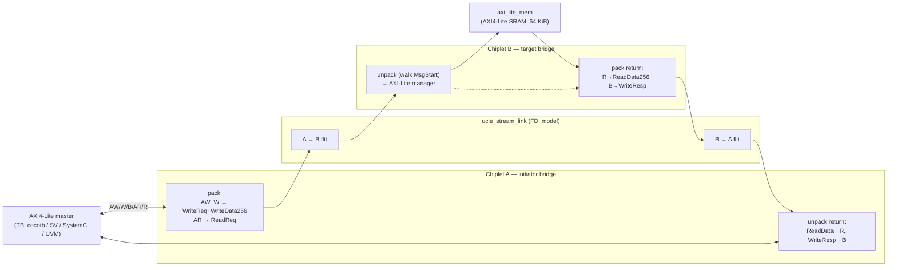
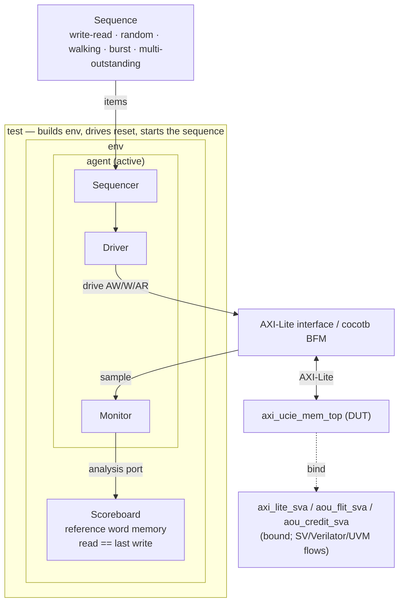

# axi-on-ucie-to-mem

[](https://github.com/markrthomas/axi-on-ucie-to-mem/actions/workflows/ci.yml)

**AXI4-Lite transported over an AXI-over-UCIe (AoU) link to an AXI-Lite memory**,
verified in **five DV environments** — cocotb + PyUVM, Icarus, Verilator, SystemC,
and a license-gated SystemVerilog UVM mirror — that all cross-check the same
design against the same reference-memory model. Digital-only, open-source
toolchain. Sibling project to `uvm_review`.

## What it is

The design bridges an on-chip **AXI4-Lite** interface across a modeled **UCIe
streaming (FDI) link** using the **AXI-over-UCIe (AoU) Basic Profile** message
set, delivering transactions to a far-side **AXI4-Lite SRAM memory**. AXI is the
OCA non-coherent bus protocol carried over UCIe (OCA System Architecture spec
§5.2), so the memory speaks AXI natively rather than a peripheral bus like APB.

Two "chiplets" are joined by the link. The initiator bridge turns AXI writes and
reads into AoU messages, **packs multiple messages into one 250-byte PLP flit**
(a real 10-byte protocol header with the `MsgStart[47:0]` granule bitmap plus
48 × 5-byte granules of payload), and the target bridge **walks that bitmap** to
unpack them and drive the memory.



## AoU Basic-Profile mapping (spec §5)

Each AXI transaction maps to AoU messages with the spec's exact field widths and
granule counts (1 granule = 5 bytes = 40 bits; 48 granules per PLP payload):

| AXI action | AoU messages (granules) | Direction |
|------------|-------------------------|-----------|
| write (AW+W) | `WriteReq` (3) + `WriteData256` (8) packed in one flit | A → B |
| read (AR)    | `ReadReq` (3)                                          | A → B |
| read data (R)  | `ReadData256` (8)                                   | B → A |
| write resp (B) | `WriteResp` (1)                                     | B → A |

A write flit therefore carries **two messages** (`MsgStart` bits 0 and 3 set),
exercising real multi-message packing; the unpacker is bitmap-driven. This build
covers the Basic Profile, Resource Plane RP0, 32-bit AXI4 with **INCR/WRAP/FIXED
bursts** (`AxLEN` beats, `AxSIZE`, burst type carried in `FLEX[1:0]` since AoU has
no `AxBURST`; the target expands each burst into single-beat AXI-Lite accesses,
`DLENGTH=256b` per beat) and **multiple-outstanding transactions with in-order
completion** (a request queue in the initiator bridge lets several transactions be
in flight at once). AXI data occupies the low 32 bits of the AoU data field and
the AoU 10-bit ID carries a per-transaction tag echoed on `{B,R}ID`. Flit fields are packed **byte-exact** to the spec (§5.8 message
layouts and the §4.3 Figure-5 protocol header), and **§6 per-message-type credit
flow control** (RP0) runs on both bridges, carried in the header `MsgCredit`
field. The interface follows the full §8 activation state machine — bring-up
(with a §6.4.2 `CrdtGrant` / §6.4.3 reset credit exchange), teardown,
re-activation, and `ERROR` recovery (no AXI accepted until `ENABLED`).
See [`docs/PLAN.md`](docs/PLAN.md) for the full architecture and the remaining
out-of-scope follow-ons (multiple resource planes; wide 512b/1024b data and true
out-of-order-by-ID completion).

## Directory layout

- `rtl/` — the design:
  - `aou_pkg.sv` — AoU message formats + flit pack/unpack helper functions
  - `ucie_stream_link.sv` — one-directional flit channel (FDI-boundary model)
  - `aou_axi_initiator_bridge.sv` / `aou_axi_target_bridge.sv` — the two bridges
  - `axi_lite_mem.sv` — AXI4-Lite SRAM memory target
  - `axi_ucie_mem_top.sv` — the DUT top (wires the chain + return link)
- `dv/cocotb/` — cocotb + PyUVM testbench (the golden runnable env)
- `dv/sv/` — portable self-checking SV directed TB (Icarus + Verilator)
- `dv/sva/` — AXI-Lite + AoU-flit + §6 credit assertion checkers (bound to the DUT)
- `dv/pack/` — §4.3/§5.8 byte-exact packing conformance TB (Icarus + Verilator)
- `dv/act/` — §8 activation FSM unit test: deactivate / re-activate / `ERROR` (Icarus + Verilator)
- `dv/reorder/` — per-ID response reorder buffer unit test: out-of-order-by-ID completion (Icarus + Verilator)
- `dv/systemc/` — SystemC testbench (`verilator --sc` model + `sc_main`)
- `uvm/` — SystemVerilog UVM TB (multi-file + single-file), license-gated
- `sim/` — Verilator C++ coverage harness
- `formal/` — SymbiYosys proof of `axi_lite_mem` (`.sby` + property wrapper)
- `Dockerfile` / `docker/` / `railway.toml` — containerized DV gate (see [`docs/DOCKER.md`](docs/DOCKER.md))
- `Makefile` — standard DV gate targets; `docs/PLAN.md` — the design plan

## The five DV environments

All drive the same DUT and check reads against a reference word memory.

| Environment | Directory | Runs here? | What it is |
|-------------|-----------|-----------|------------|
| cocotb + PyUVM | `dv/cocotb/` | ✅ | AXI-Lite BFM + driver/monitor/agent/scoreboard; write-read / random / walking / burst / multi-outstanding tests |
| Icarus (SV) | `dv/sv/` | ✅ | portable self-checking SV directed TB under `iverilog`+`vvp` |
| Verilator (SV) | `dv/sv/` | ✅ | same SV TB under `--binary --timing`, **plus bound SVA** (`--assert`) |
| SystemC | `dv/systemc/` | ✅ | `verilator --sc` DUT model + hand-written `sc_main` driver/scoreboard |
| SystemVerilog UVM | `uvm/` | ⚠️ skips | full UVM mirror; needs VCS/Xcelium/Questa — skips cleanly if unlicensed |

The **PyUVM** and **UVM** testbenches map one-for-one:

| PyUVM (`dv/cocotb/`) | SystemVerilog UVM (`uvm/`) |
|----------------------|----------------------------|
| `axi_lite_bfm.py` (cocotb BFM) | `axi_lite_if.sv` + driver/monitor virtual interface |
| `AxiSeqItem` | `axi_seq_item.sv` |
| `axi_seq.py` sequences | `axi_sequences.sv` |
| driver / monitor / agent | `axi_driver.sv` / `axi_monitor.sv` / `axi_agent.sv` |
| `AxiScoreboard` | `axi_scoreboard.sv` |
| `AxiEnv` | `axi_env.sv` |
| tests + `@cocotb.test` | `axi_test.sv` + `axi_ucie_tb_top.sv` (`run_test`) |



## Verification

Everything runs from the repo root and degrades gracefully if a tool is absent.

| Flow | Command | What it does |
|------|---------|--------------|
| Full regression | `make test` | all five cocotb tests (write-read, random, walking, burst, multi-outstanding) |
| Directed | `make test-write-read` / `test-random` / `test-walking` / `test-burst` / `test-outstanding` | one cocotb test |
| SV (Icarus) | `make sv` | portable SV directed TB under Icarus |
| SV (Verilator) | `make vlt` | same TB under Verilator + bound SVA assertions |
| Packing | `make pack` | §4.3/§5.8 byte-exact packing conformance, incl. 512b/1024b data (Icarus + Verilator) |
| Activation | `make act` | §8 activation FSM unit test: bring-up / deactivate (Opt-1 & Opt-2) / ERROR (Icarus + Verilator) |
| Reorder | `make reorder` | per-ID response reorder buffer: out-of-order-by-ID completion (Icarus + Verilator) |
| SystemC | `make systemc` | SystemC TB (Verilator `--sc` + `sc_main`) |
| SV/UVM | `make uvm` | UVM TB (VCS/Xcelium/Questa); skips cleanly if unlicensed |
| Waves | `make waves` / `make wave` | dump / open GTKWave |
| Lint | `make lint` | `iverilog -Wall` + Verilator RTL lint |
| Coverage | `make coverage` | Verilator `--coverage` → `sim/coverage.info` (floor `COV_MIN`, default 85%; ~90–94% achieved) |
| Formal | `make formal` | SymbiYosys proof of `axi_lite_mem` (bmc + cover + unbounded `prove`); skips cleanly if `sby` absent |
| Gate | `make check` | lint + cocotb + SV(both sims) + pack + act + reorder + SystemC |
| CI | `make ci` | `check` + coverage as one pass/fail gate |
| Container | `docker run --rm aou-dv` | the whole `make ci` gate in a reproducible image ([`docs/DOCKER.md`](docs/DOCKER.md)) |
| Trace | `make <target> VERBOSE=1` | per-beat AXI transaction traces in each env's log |

Run `make help` for the full list.

**Transaction tracing.** Add `VERBOSE=1` to any target (it exports `AOU_VERBOSE`
to the sub-makes) to log every AW/W/B/AR/R beat — address, data, id, burst,
resp, last — for debugging. The SV directed TB and SystemC TB tag their lines
`[SV-TB][T]` / `[SC-TB][T]`, the coverage harness `[sim_cov][T]`, and the cocotb
BFM raises its `axi.bfm` logger to `DEBUG`. Off by default, so normal runs (and
CI) stay byte-identical:

```bash
make sv VERBOSE=1        # SV directed TB, per-beat traces to dv/sv/sim_build/icarus.log
make systemc VERBOSE=1   # SystemC TB, traces to dv/systemc/sc.log
make test-burst VERBOSE=1
```

## Tutorial

Every command is run from the repo root unless noted.

### 1. Toolchain

The runnable flows need Icarus Verilog, Verilator **5.x** (for `--binary` /
`--timing` / `--sc`), a Python with cocotb + pyuvm, and (for SystemC)
`libsystemc-dev`:

```bash
iverilog -V | head -1
verilator --version                 # expect 5.x
python3 -c "import cocotb, pyuvm; print(cocotb.__version__, pyuvm.__version__)"
```

If missing: `python3 -m pip install cocotb==1.9.2 pyuvm==4.0.1`. The cocotb
runner pins `ICARUS_BIN_DIR=/usr/bin` and the cocotb-bound interpreter so the VPI
is built against the same Python that imports the testbench.

### 2. Run the regression

```bash
make test        # three cocotb PASS lines, exit 0
```

Each test builds the env, pulses reset via the BFM, runs its sequence, and the
scoreboard asserts `errors == 0` in its check phase.

### 3. The other environments

```bash
make sv          # SV directed TB under Icarus       -> "[SV] Icarus PASSED"
make vlt         # SV directed TB under Verilator + SVA -> "[SV] Verilator PASSED"
make pack        # byte-exact packing conformance      -> "[PACK] Icarus/Verilator PASSED"
make systemc     # SystemC TB                          -> "[SC] SystemC PASSED"
```

Each self-checking TB prints a `... PASS: N reads checked, 0 errors` banner (the
SV and SystemC read counts differ, as each walks single-beat, INCR/WRAP/FIXED
burst, and multiple-outstanding traffic). All four runnable environments
cross-check the identical DUT.

### 4. Coverage, lint, and the CI gate

```bash
make lint        # iverilog -Wall + Verilator lint
make coverage    # Verilator --coverage -> sim/coverage.info (floor COV_MIN=85)
make ci          # lint + cocotb + SV(both) + SystemC + coverage, one gate
```

Lower the coverage bar for a quick look with `make coverage COV_MIN=80`.

### 5. Waveforms

```bash
make waves                    # dump dv/cocotb/sim_build/axi_ucie_mem_top.fst
make wave                     # + open GTKWave (skips cleanly if not installed)
make waves TEST=random_test   # just one test
```

`make wave` applies the curated layout in `dv/wave.gtkw`, so the window opens
with the AXI front-door, flit-link, and memory-port signals already added — look
at the AXI `AW`/`W` handshake, then a flit valid on the link, then the far-side
memory write and the `WriteResp` flit returning to complete `B`.

> **GTKWave opens blank / looks hung?** GTKWave never auto-populates its wave
> pane; opening a raw FST with no savefile shows an empty window that reads as a
> hang. `make wave` avoids this by passing `-a dv/wave.gtkw`. It also runs with
> `NO_AT_BRIDGE=1`, which skips the AT-SPI accessibility bus whose missing-server
> timeout is the usual cause of multi-second GTK startup stalls under WSLg or a
> headless X server. The `.fst` itself is fine either way — verify with
> `fst2vcd dv/cocotb/sim_build/axi_ucie_mem_top.fst | head`.

### 6. The SystemVerilog UVM testbench

```bash
make uvm                        # multi-file set, default write-read test
make uvm TEST=axi_random_test   # pick a test
make uvm SINGLE=1               # build the single-file variant instead
```

This host has no UVM license, so `make uvm` prints a skip and exits 0. On a
licensed host it auto-detects VCS / Xcelium / Questa, elaborates the DUT +
interface + UVM package + the bound `axi_lite_sva` / `aou_flit_sva` checkers, and
runs `+UVM_TESTNAME=<test>`.

**On [EDA Playground](https://www.edaplayground.com)** (free UVM-capable
simulators): paste `uvm/axi_ucie_tb_single.sv` into `testbench.sv`, and the
**concatenated** DUT RTL — `rtl/aou_pkg.sv`, `ucie_stream_link.sv`,
`axi_lite_mem.sv`, `aou_axi_initiator_bridge.sv`, `aou_axi_target_bridge.sv`,
`axi_ucie_mem_top.sv`, in that order — into `design.sv`. Tick **UVM 1.2**, pick a
simulator, and add `+UVM_TESTNAME=axi_write_read_test` (or `axi_random_test` /
`axi_walking_test`) to the run options.

### 7. Formal proof of the memory target

```bash
make formal              # bmc + cover + unbounded prove
make formal TASK=bmc     # just one task (bmc | cover | prove)
```

[SymbiYosys](https://github.com/YosysHQ/sby) proves the AXI4-Lite memory
`axi_lite_mem` (`formal/axi_lite_mem_fv.sv` wraps it with assume/assert/cover):

- **channel legality** — `VALID` held until `READY`, request/response payloads
  stable while stalled, `BRESP`/`RRESP` always `OKAY`;
- **no response without a request** — saturating handshake counters keep
  `n_b ≤ n_aw`, `n_b ≤ n_w`, `n_r ≤ n_ar`;
- **write → read data integrity** — an independent reference array, written per
  the AXI byte-strobe spec, must match every value the DUT returns on a read;
- **cover** — a write completes, a read completes, and a read returns written
  (non-zero) data, so the properties are provably non-vacuous.

`bmc` and `cover` are bounded (depth 24 / 32); **`prove` (abc pdr) is an
_unbounded_ proof** — the properties hold for all time, not just the bound.

Notes: the proof targets `axi_lite_mem` in isolation with a deliberately small
address width (`.sby` reads with `-defer`; otherwise the 64 KiB array bit-blasts
and never elaborates). The full AoU chain is **not** formally verified — the
open-source Yosys frontend cannot elaborate the wide pack/unpack functions and
2000-bit flit datapath in tractable time; that stays with the simulation
environments above.

### 8. Containerized gate (Docker / Railway)

Run the entire gate in a reproducible image — no local toolchain needed:

```bash
docker build -t aou-dv .          # builds Icarus + pinned Verilator + SystemC + cocotb
docker run --rm aou-dv            # runs `make ci`; exits 0 on green
docker run --rm aou-dv make reorder   # or any single environment
```

The image (Ubuntu 24.04) mirrors CI exactly: apt Icarus + SystemC 2.3.3, Verilator
pinned to oss-cad-suite `5.047`, and cocotb 1.9.2 / pyuvm 4.0.1 in a venv. On
memory-constrained builders, cap Verilator's compile parallelism with
`VL_JOBS` (the image defaults to `2`; use `-e VL_JOBS=1` on the smallest hosts,
`-e VL_JOBS=0` where RAM is ample):

```bash
docker run --rm -e VL_JOBS=1 aou-dv
```

Deploy on **[Railway](https://railway.com)** as a one-off / cron **job** (it has no
listening port — it runs the gate and exits): `railway.toml` selects the Dockerfile
builder with `restartPolicyType = "NEVER"`. Full operation, tuning, and gotchas —
including why `python3-dev` and the `VL_JOBS` cap are required — are in
[`docs/DOCKER.md`](docs/DOCKER.md).

## Scope & follow-ons

This pass implements the Basic Profile message formats, **byte-exact flit
packing** (§5.8 message layouts + the §4.3 Figure-5 protocol header), **§6
per-message-type credit flow control** on RP0 (carried in the header `MsgCredit`
field, with a bound safety assertion), and the full §8 **interface state
machine** — bring-up (`ActivateReq`/`ActivateAck` + the §6.4.2 `CrdtGrant` Misc
message and §6.4.3 reset-during-`ACTIVATE` credit exchange), teardown
(`DeactivateReq`/`DeactivateAck`), re-activation, and `ERROR` entry/recovery. No
AXI is accepted until the interface is `ENABLED`; transmit credits reset to zero
(§8.4) on every entry to `DISABLED` and are (re-)seeded from the peer's
`CrdtGrant`. Explicitly **out of scope for now** (documented in
`docs/PLAN.md`), in rough priority order:

- **Deactivate quiescing Option 2** (spec §8.3.2) — only Option 1 (System
  Software quiesces the link before setting the deactivate flag; MANDATORY) is
  modeled; hardware-managed quiescing (OPTIONAL) is not.
- **Multiple resource planes** (RP0..RP3).
- **Full AXI4, remaining parts** — 512b/1024b wide data and true
  out-of-order-by-ID completion. (INCR/WRAP/FIXED bursts and multiple-outstanding
  transactions with in-order completion are **implemented**; genuine OOO has no
  natural source in the single-link / single-in-order-memory topology.)
- **Whole-chain formal** — the current proof covers `axi_lite_mem`; proving the
  bridges/flit path needs a Verific-based front end (or hand-abstracted flits).

## Specs

Built to the OCA drafts (kept locally in `docs/`, **not** redistributed here —
copyrighted Tenstorrent drafts; get them from
[openchipletatlas.org](https://openchipletatlas.org)):
- **AXI over UCIe Protocol Specification v0.8** — the transport/message protocol.
- **Open Chiplet Atlas System Architecture Specification v0.8** — umbrella spec.

## Toolchain

- Simulators: **Icarus Verilog** (cocotb + directed SV), **Verilator 5.x**
  (directed SV `--binary`, SystemC `--sc`, coverage)
- **SystemC 2.3.3** (`libsystemc-dev`)
- Python: **cocotb 1.9.2** + **pyuvm 4.0.1** (system `python3`)
- UVM flow: any of **VCS / Xcelium / Questa** (license-gated; not on this host)
- Container: a **`Dockerfile`** packages all of the above (bar the UVM flow) into
  the `aou-dv` image and runs the gate; deployable on Railway — see
  [`docs/DOCKER.md`](docs/DOCKER.md)
